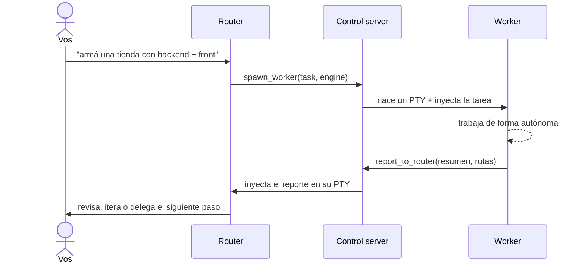

# 🧭 HyprDesk

> **Orquestá un equipo de agentes de IA de código, en tu escritorio.**


HyprDesk es una app de escritorio donde un agente **router** —con el que hablás— **lidera** el trabajo:
piensa, investiga, diseña la arquitectura, escribe el código crítico, y **delega la ejecución** a
agentes **worker**, cada uno en su propia terminal real. Todos se comunican por un **túnel MCP local
bidireccional** — en esencia, **A2A (Agent2Agent) corriendo en tu máquina**: los agentes se consultan
y se reportan entre sí, y vos podés intervenir en cualquiera en cualquier momento.

Mezclás motores libremente — **Claude Code, Codex y OpenCode** pueden ser router o worker — sobre una
superficie tipo IDE (editor de código, diffs, preview embebido, control de cambios con git), con
**perfiles de agentes creados con IA**, **aislamiento por git worktrees** y **merge-back** automático.

> 🛠️ **En desarrollo activo.** Proyecto de código abierto (MIT). Se mueve rápido; issues y PRs bienvenidos.

---

## ✨ Qué hace

- 🖥️ **Terminales reales** embebidas (xterm.js + PTY vía Rust/Tauri) — no simulaciones: corrés
  `claude`, `codex`, `opencode`, `htop`, lo que sea.
- 🧭 **Router-líder → workers por MCP**: el router hace el trabajo pesado de pensamiento (investiga,
  diseña, escribe lo crítico) y **delega la ejecución** con `spawn_worker` / `send_to_worker`;
  `list_workers` para **reutilizar** especialistas por dominio en vez de crear de más.
- 🔀 **Multi-motor mezclable**: Claude / Codex / OpenCode, cada uno como router **o** worker. El rol se
  inyecta como *system prompt* (no gasta un turno del agente). Modelo y *effort* elegibles por agente.
- 🤖 **Perfiles de agentes con IA**: describís el agente en lenguaje natural y un meta-agente arma el
  perfil (motor + modelo + effort + persona + color) contra los modelos que realmente tenés autenticados.
- 🌿 **Aislamiento por git worktrees + merge-back**: en repos git, cada worker trabaja en su propia
  rama/worktree para no pisarse; el router **integra** las ramas a la principal (`merge_worker`).
- 🗂️ **Multi-workspace keep-alive**: varios proyectos abiertos en tabs a la vez; cambiás al instante
  sin matar agentes ni gastar tokens (todos siguen vivos en segundo plano).
- 📄 **Superficie IDE**: visor/editor de código (CodeMirror, ⌘S para guardar), tiles de **diff**, y
  **navegador embebido** (iframe para localhost/HTML; webview nativa para sitios externos) con
  autodetección de `localhost:PUERTO`.
- 🔍 **Control de cambios en vivo**: un watcher del workspace + `git status`/`git diff` → panel de
  archivos modificados y un chip "N cambios" para no perderte lo que toca un agente.
- 📂 **Abrí cualquier carpeta**: enlazá un proyecto real existente como workspace (no destructivo —
  nunca borra tu carpeta; su estado va aparte, sin ensuciar tu repo).
- 🔐 **Modo de permisos configurable**: *autónomo* (bypass, fluye solo) o *preguntar* (revisás cada
  edición/comando) — por si querés leer antes de que ejecute.
- 💾 **Persistencia**: reabrís un workspace y los agentes reviven con `--resume` (session-id).
- 🍎 **Integración nativa macOS**: barra de menú (Archivo/Editar/Ver/Ventana), múltiples ventanas,
  pegar imágenes en cualquier tile, y cuota de GLM (z.ai) en el header.

## 📸 Capturas

**Un router delegando a dos workers en paralelo** — OpenCode como router, Claude y Codex como
workers, cada uno en su terminal real; a la derecha, un worker mostrando su diff en vivo.


**Superficie IDE** — explorador de archivos + editor de código (CodeMirror) con el contador de cambios.


**Command palette (⌘K)** sobre la grilla de agentes.


**Selector de router** al abrir un workspace — elegís Claude Code, Codex u OpenCode.


## 🏗️ Arquitectura


- **Frontend** (`desktop/src/`): React + xterm.js — tiles (terminal/código/diff/browser), layout
  tipo tiling, paneles (agentes, workspaces, archivos, cambios), command palette.
- **Backend** (`desktop/src-tauri/src/`): Rust/Tauri —
  `lib.rs` (`PtyManager` + comandos), `control.rs` (control server HTTP = hub del túnel + roster de
  workers), `engines.rs` (adaptadores por motor + modelo/effort/persona), `worktree.rs` (aislamiento +
  merge), `changes.rs` (watcher + git), `workspace.rs` (workspaces), `settings.rs` (config +
  meta-agente + cuota GLM), `fsops.rs` (archivos), `browser.rs` (webview nativa).
- **MCP** (`desktop/mcp/`): servidor stdio *role-aware* que expone las tools de router vs worker
  (`spawn_worker`, `send_to_worker`, `list_workers`, `merge_worker` / `report_to_router`, `ask_router`).

## 🔌 El túnel (cómo delega)



## 🧠 Motores soportados

| Motor | Router | Worker | Rol inyectado como |
|------|:------:|:------:|--------------------|
| Claude Code | ✅ | ✅ | `--append-system-prompt` |
| Codex | ✅ | ✅ | `-c developer_instructions=…` |
| OpenCode | ✅ | ✅ | `instructions` en el config |

## 📦 Requisitos

- macOS (probado), Node 20+, pnpm, Rust/Cargo.
- Los CLIs de los agentes instalados y logueados: `claude`, y opcionalmente `codex` / `opencode`.
- `git` en el PATH (para el control de cambios).

## 🚀 Build e instalación

```bash
cd desktop
pnpm install

# desarrollo (abre la ventana con hot-reload)
pnpm tauri dev

# build de producción → genera HyprDesk.app
pnpm tauri build
# y lo instalás copiándolo:
cp -R src-tauri/target/release/bundle/macos/HyprDesk.app /Applications/
```

## 🕹️ Uso

1. **Creá un workspace** (carpeta nueva en `~/HyprDesk/`) o **abrí una carpeta existente** (tu
   proyecto real, enlazado y no destructivo).
2. Elegí el **motor del router** (Claude / Codex / OpenCode).
3. **Hablale al router** como a cualquier agente: *"investigá X y armá una landing"*. Él delega
   workers reales que trabajan y le reportan; vos ves todo en vivo y podés intervenir en cualquier tile.

## 📁 Estructura del repo

```
desktop/            → la app HyprDesk (Tauri v2 + React + Rust) — el proyecto principal
  src/              frontend (tiles, IDE surface, paneles, palette)
  src-tauri/src/    backend Rust (PTYs, túnel, engines, watcher/git, workspaces)
  mcp/              MCP server role-aware + roles (router/worker)
cli/                → prototipo previo: orquestador router→worker por CLI, standalone
```

## 🔒 Seguridad

Por defecto los agentes corren en **modo autónomo** (bypass de permisos: `--dangerously-skip-permissions`
en claude, `--dangerously-bypass-approvals-and-sandbox` en codex, permisos abiertos en opencode) para
trabajar sin pedirte aprobación en cada paso — es el punto de la delegación. Podés cambiar a **modo
"preguntar"** en Configuración para revisar cada edición/comando. El radio de acción es la carpeta del
workspace. **Usalo en una máquina local de confianza y con tareas/entradas confiables.**

## 🗺️ Roadmap

**Hecho**
- [x] Workspaces + persistencia (resume) + entorno saneado
- [x] Túnel MCP bidireccional + multi-motor (claude/codex/opencode) mezclable
- [x] Multi-workspace keep-alive en tabs
- [x] Superficie IDE: editor de código, diffs, navegador (iframe + webview nativa)
- [x] Control de cambios en vivo (watcher + git)
- [x] Abrir carpetas externas (enlazadas, no destructivas)
- [x] Integración nativa macOS (menú + ventanas)
- [x] Perfiles de agentes con IA (por-workspace, modelo/effort/persona)
- [x] Reutilización de workers (`list_workers`) + router-líder
- [x] Git worktrees por worker + merge-back del router
- [x] Modo de permisos configurable (auto / preguntar)

**En cola**
- [ ] Delegación por perfil (`list_profiles`) + `ask_user` (el router usa tus agentes o te pregunta)
- [ ] Estado por agente + vista de equipo/grafo
- [ ] Crítico / review antes de mergear · memoria del router entre sesiones
- [ ] Multi-ventana "de verdad" (ruteo por-ventana), tema claro/oscuro, firma/notarización

## 🤝 Contribuir

Issues y PRs bienvenidos. Para desarrollar:

```bash
cd desktop && pnpm install
pnpm tauri dev            # ventana con hot-reload
pnpm exec tsc --noEmit    # typecheck del frontend
cd src-tauri && cargo build   # backend
```

Antes de un PR: que compilen `tsc --noEmit` y `cargo build`. Estilo: seguí el código existente
(comentarios en español, mismo idioma/idiom del módulo). El MCP server y los roles viven en
`desktop/mcp/` (`hyprdesk-mcp.mjs`, `router-role.md`, `worker-role.md`).

## 📄 Licencia

[MIT](LICENSE) © [Mats2208](https://github.com/Mats2208)

---

Hecho con 🦀 Rust + ⚛️ React + [Tauri](https://tauri.app) por [@Mats2208](https://github.com/Mats2208).
