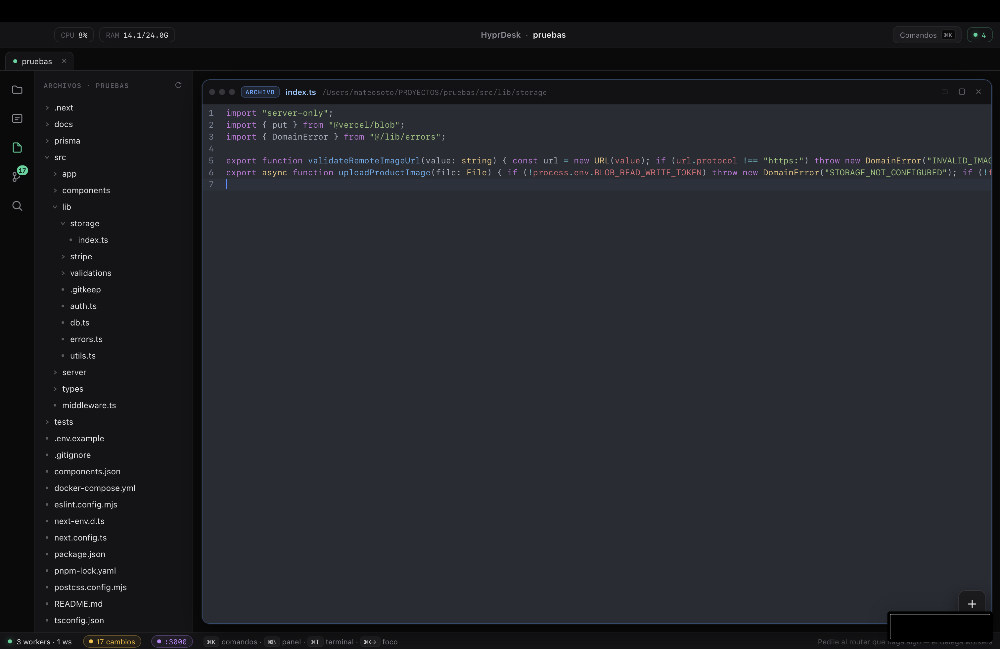
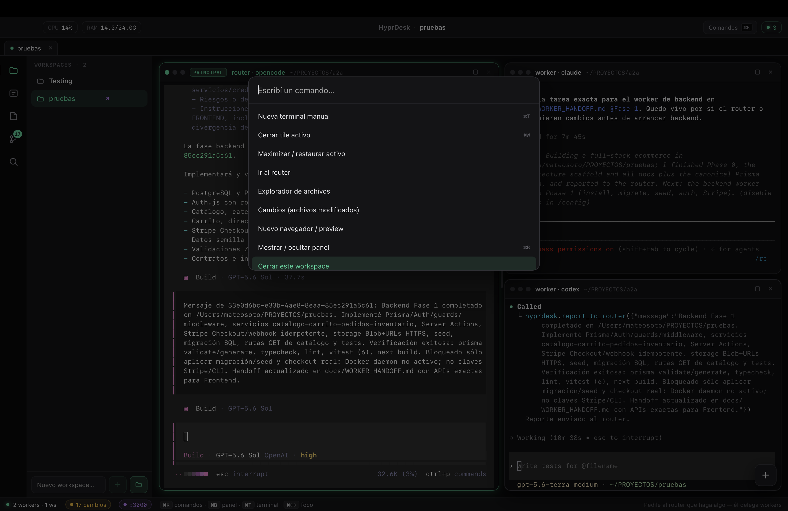
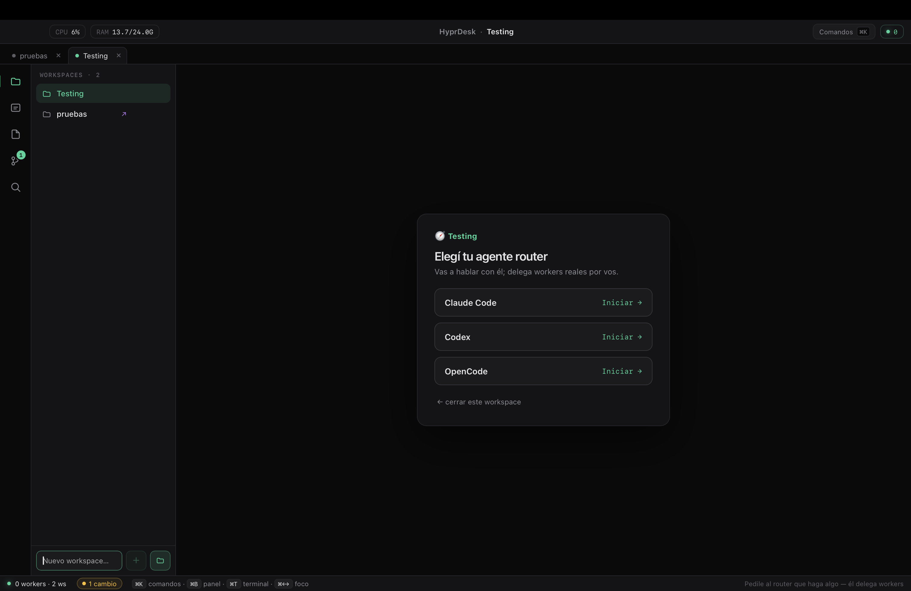
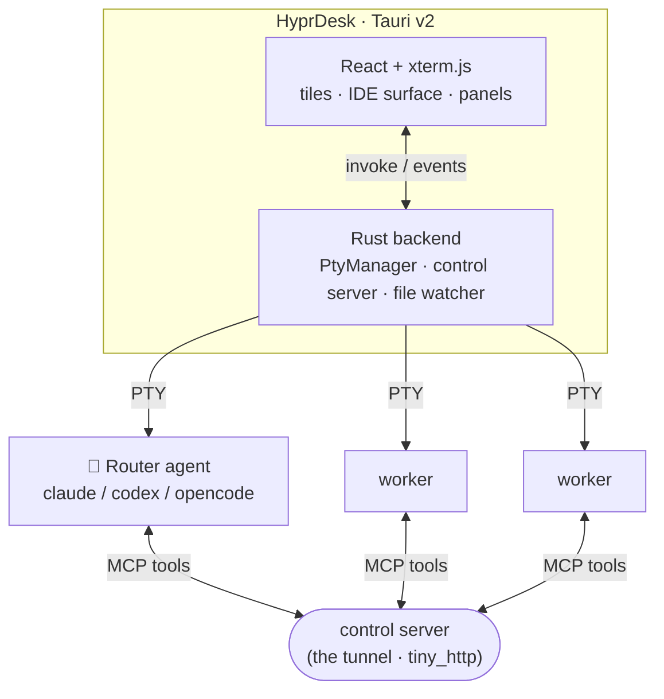
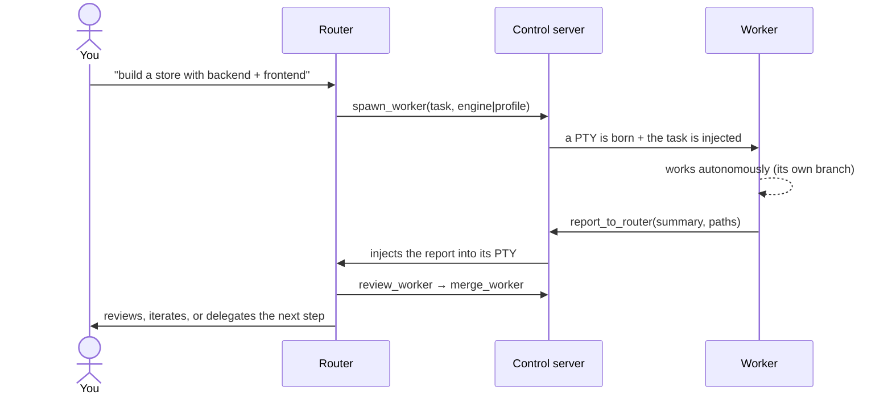

<div align="center">

# 🧭 HyprDesk

**Orchestrate a team of AI coding agents on your desktop.** A **router** agent — the one you talk to — _leads_: it thinks, investigates, designs, writes the critical code, and **delegates execution** to **worker** agents, each in its own real terminal. They all talk over a **local bidirectional MCP tunnel** — **A2A (Agent-to-Agent) running on your machine**.

[](https://github.com/Mats2208/hyprdesk)
[](https://github.com/Mats2208/hyprdesk)
[](https://tauri.app)
[](https://www.rust-lang.org)
[](https://react.dev)
[](https://modelcontextprotocol.io)
[](LICENSE)

<br/>

<table>
<tr>
<td align="center"><strong>3 Engines</strong><br/><sub>Claude · Codex · OpenCode</sub></td>
<td align="center"><strong>Router → N Workers</strong><br/><sub>parallel, real terminals</sub></td>
<td align="center"><strong>Local A2A Tunnel</strong><br/><sub>bidirectional MCP</sub></td>
<td align="center"><strong>git Worktrees</strong><br/><sub>isolation + merge-back</sub></td>
<td align="center"><strong>IDE Surface</strong><br/><sub>editor · diff · preview</sub></td>
</tr>
</table>

**Mix engines freely — Claude Code, Codex and OpenCode can each be router _or_ worker — on an IDE-like surface, with AI-built agent profiles, git-worktree isolation and automatic merge-back.**

</div>

---

## Showcase

<p align="center">
  
</p>
<p align="center"><sub>A router delegating to two workers in parallel — OpenCode routing, Claude + Codex working, one showing its live diff on the right</sub></p>

<table>
<tr>
<td width="50%">
<p align="center"></p>
<p align="center"><sub>IDE surface — file explorer + CodeMirror editor with the live change counter</sub></p>
</td>
<td width="50%">
<p align="center"></p>
<p align="center"><sub>Command palette (⌘K) over the agent grid</sub></p>
</td>
</tr>
</table>

<p align="center">
  
</p>
<p align="center"><sub>Pick the router engine when you open a workspace — Claude Code, Codex or OpenCode</sub></p>

---

## What it does

A desktop app where one agent **leads** a team of others, all wired through a local MCP tunnel.

| | Feature | Details |
|---|---------|---------|
| **Lead agent** | Router leads & delegates | The router does the heavy thinking (investigate, design, write the critical code) and delegates execution with `spawn_worker` / `send_to_worker` — not a dumb dispatcher |
| **Multi-engine** | Claude · Codex · OpenCode | Any of them as router **or** worker. The role is injected as a *system prompt* — no wasted turn. Model & reasoning effort selectable per agent |
| **Local A2A** | Bidirectional MCP tunnel | Agents consult and report to each other through a `tiny_http` control server; you can jump into any terminal at any time |
| **Profiles** | AI-built agent personas | Describe an agent in natural language → a meta-agent builds the profile (engine + model + effort + persona + color) against the models you actually have authenticated. Or build one **manually** |
| **Delegation** | By profile, or it asks you | The router sees your profiles (`list_profiles`) and delegates to the right one — or asks you which to use (`ask_user`) instead of spawning generic workers |
| **Isolation** | git worktrees + merge-back | In git repos, each worker gets its own branch/worktree so they never collide; the router **integrates** branches into main (`merge_worker`) |
| **Review** | Critic before merge | The router reads a worker's diff (`review_worker`) and verifies it before integrating — no blind merges |
| **Memory** | Router memory across sessions | A per-workspace memory doc the router maintains (`save_memory`) and gets re-injected on reopen — it resumes with context |
| **IDE surface** | Editor · diff · preview | CodeMirror viewer/editor (⌘S), diff tiles, and an embedded browser (iframe for localhost/HTML, native webview for external sites) with `localhost:PORT` auto-detection |
| **Change control** | Live git tracking | A workspace watcher + `git status`/`git diff` → a modified-files panel and an "N changes" chip so you never miss what an agent touched |
| **Workspaces** | Multi-workspace keep-alive | Several projects open in tabs at once; switch instantly without killing agents or burning tokens (all stay alive in the background) |
| **Open any folder** | Non-destructive linking | Link a real existing project as a workspace — never deletes your folder; its state lives apart, without polluting your repo |
| **Permissions** | Autonomous or ask | *Autonomous* (bypass, flows on its own) or *ask* (review every edit/command) |
| **Persistence** | Resume sessions | Reopen a workspace and agents revive via `--resume` (session-id) |
| **Native macOS** | Menu · windows · paste images | Menu bar, multiple windows, paste images into any tile, and GLM (z.ai) quota in the header |

## Installation

> **Requirements** — macOS · [Node 20+](https://nodejs.org) · [pnpm](https://pnpm.io) · [Rust/Cargo](https://rustup.rs) · `git` in PATH.
> Plus the agent CLIs installed and logged in: **[`claude`](https://docs.claude.com/en/docs/claude-code)** (required), and optionally **`codex`** / **`opencode`**.

**1. Clone and install**

```bash
git clone https://github.com/Mats2208/hyprdesk
cd hyprdesk/desktop
pnpm install
```

**2. Run in development** (window with hot-reload)

```bash
pnpm tauri dev
```

**3. Build the app** → produces `HyprDesk.app`, then install by copying it

```bash
pnpm tauri build
cp -R src-tauri/target/release/bundle/macos/HyprDesk.app /Applications/
```

> Launching from Finder uses a minimal PATH — HyprDesk resolves your real login-shell PATH at startup so it can find `claude` / `codex` / `node`.

## Quick start

1. **Create a workspace** (a new folder in `~/HyprDesk/`) or **open an existing folder** (your real project — linked, non-destructive).
2. Pick the **router engine** (Claude / Codex / OpenCode).
3. **Talk to the router** like any agent:

   > *"Investigate the codebase and build a landing page with a backend."*

   It delegates real workers that work and report back; you watch it all live and can jump into any tile.

## Architecture



- **Frontend** (`desktop/src/`): React + xterm.js — tiles (terminal/code/diff/browser), tiling layout, panels (agents, workspaces, files, changes), command palette.
- **Backend** (`desktop/src-tauri/src/`): Rust/Tauri — `lib.rs` (`PtyManager` + commands), `control.rs` (HTTP control server = tunnel hub + worker roster), `engines.rs` (per-engine adapters + model/effort/persona), `worktree.rs` (isolation + merge), `memory.rs` (router memory), `changes.rs` (watcher + git), `workspace.rs`, `settings.rs` (config + meta-agent + GLM quota), `browser.rs` (native webview).
- **MCP** (`desktop/mcp/`): a *role-aware* stdio server exposing router vs worker tools (`spawn_worker`, `send_to_worker`, `list_workers`, `list_profiles`, `review_worker`, `merge_worker`, `ask_user`, `save_memory` / `report_to_router`, `ask_router`).

### How it delegates



## Supported engines

| Engine | Router | Worker | Role injected as |
|--------|:------:|:------:|------------------|
| Claude Code | ✅ | ✅ | `--append-system-prompt` |
| Codex | ✅ | ✅ | `-c developer_instructions=…` |
| OpenCode | ✅ | ✅ | `instructions` in the config |

## Repo layout

```
desktop/            → the HyprDesk app (Tauri v2 + React + Rust) — the main project
  src/              frontend (tiles, IDE surface, panels, palette)
  src-tauri/src/    Rust backend (PTYs, tunnel, engines, watcher/git, workspaces, memory)
  mcp/              role-aware MCP server + roles (router/worker)
cli/                → earlier prototype: a standalone router→worker CLI orchestrator
```

## Security

By default agents run in **autonomous mode** (permission bypass: `--dangerously-skip-permissions` on claude, `--dangerously-bypass-approvals-and-sandbox` on codex, open permissions on opencode) so they work without asking for approval at every step — that's the point of delegation. Switch to **"ask" mode** in Settings to review each edit/command. The blast radius is the workspace folder. **Run it on a trusted local machine, with trusted tasks and inputs.**

## Roadmap

**Done**
- [x] Workspaces + persistence (resume) + sanitized environment
- [x] Bidirectional MCP tunnel + mixable multi-engine (claude/codex/opencode)
- [x] Multi-workspace keep-alive in tabs
- [x] IDE surface: code editor, diffs, browser (iframe + native webview)
- [x] Live change control (watcher + git)
- [x] Open external folders (linked, non-destructive)
- [x] Native macOS integration (menu + windows)
- [x] AI-built agent profiles (per-workspace: model/effort/persona) + manual profiles
- [x] Worker reuse (`list_workers`) + router-as-leader
- [x] git worktrees per worker + router merge-back
- [x] Configurable permission mode (auto / ask)
- [x] Delegation by profile (`list_profiles`) + `ask_user`
- [x] Per-agent status + team view
- [x] Critic/review before merge (`review_worker`) + router memory across sessions
- [x] Launch a team of profiles at once

**Next**
- [ ] Shared handoff doc injected into all workers
- [ ] True multi-window (per-window routing) · light/dark theme
- [ ] Codex/OpenCode usage in the header · app signing/notarization

## Contributing

Issues and PRs welcome. To develop:

```bash
cd desktop && pnpm install
pnpm tauri dev            # window with hot-reload
pnpm exec tsc --noEmit    # frontend typecheck
cd src-tauri && cargo build   # backend
```

Before a PR: make sure `tsc --noEmit` and `cargo build` both pass. Style: follow the surrounding code (comments in Spanish, matching each module's idiom). The MCP server and roles live in `desktop/mcp/` (`hyprdesk-mcp.mjs`, `router-role.md`, `worker-role.md`).

## License

Released under the **[MIT License](LICENSE)** — © 2026 Mateo ([@Mats2208](https://github.com/Mats2208)).

<div align="center">

**Built with 🦀 [Rust](https://www.rust-lang.org) · ⚛️ [React](https://react.dev) · [Tauri v2](https://tauri.app) · wired through [MCP](https://modelcontextprotocol.io)**

If HyprDesk is useful to you, star it ⭐ and share it with the community.

</div>
