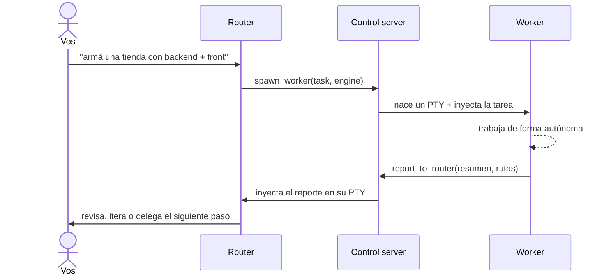

# 🧭 HyprDesk

**Orquestador local de agentes de IA en una app de escritorio.** Un agente **router** —con el que
hablás— delega tareas a agentes **worker**, cada uno en su propia terminal real, todos comunicados
por un **túnel MCP local bidireccional**. Es, en esencia, **A2A (Agent2Agent) corriendo en tu
máquina**: los agentes se consultan y se reportan entre sí, y vos podés intervenir en cualquiera.

Mezclás motores libremente — **Claude Code, Codex y OpenCode** pueden ser router o worker — sobre
una superficie tipo IDE (editor de código, diffs, preview embebido, control de cambios con git).

> ⚠️ **Prototipo / experimento**, no un producto terminado. Es un espacio para explorar la
> orquestación de agentes con una UI de escritorio. Cosas a medio hacer y en cambio constante.
> Se sube a GitHub para tener persistencia e ir iterando.

---

## ✨ Qué hace

- 🖥️ **Terminales reales** embebidas (xterm.js + PTY vía Rust/Tauri) — no simulaciones: corrés
  `claude`, `codex`, `opencode`, `htop`, lo que sea.
- 🧭 **Router → workers por MCP**: el router usa `spawn_worker` / `send_to_worker`; el worker usa
  `report_to_router` / `ask_router`. El túnel entrega los mensajes inyectándolos en el PTY destino.
- 🔀 **Multi-motor mezclable**: Claude / Codex / OpenCode, cada uno como router **o** worker. El rol
  se inyecta como *system prompt* (no gasta un turno del agente).
- 🗂️ **Multi-workspace keep-alive**: varios proyectos abiertos en tabs a la vez; cambiás al instante
  sin matar agentes ni gastar tokens (todos siguen vivos en segundo plano).
- 📄 **Superficie IDE**: visor/editor de código (CodeMirror, ⌘S para guardar), tiles de **diff**, y
  **navegador/preview** embebido con autodetección de `localhost:PUERTO`.
- 🔍 **Control de cambios en vivo**: un watcher del workspace + `git status`/`git diff` → panel de
  archivos modificados y un chip "N cambios" para no perderte lo que toca un agente.
- 📂 **Abrí cualquier carpeta**: enlazá un proyecto real existente como workspace (no destructivo —
  nunca borra tu carpeta; su estado va aparte, sin ensuciar tu repo).
- 💾 **Persistencia**: reabrís un workspace y los agentes reviven con `--resume` (session-id).
- 🍎 **Integración nativa macOS**: barra de menú (Archivo/Editar/Ver/Ventana), múltiples ventanas,
  pegar imágenes en cualquier tile.

## 📸 Capturas

<!-- Agregá las capturas en docs/ y descomentá:


-->
_Próximamente._ (Router + workers, panel de cambios/diff, preview embebido, tabs multi-workspace.)

## 🏗️ Arquitectura


- **Frontend** (`desktop/src/`): React + xterm.js — tiles (terminal/código/diff/browser), layout
  tipo tiling, paneles (agentes, workspaces, archivos, cambios), command palette.
- **Backend** (`desktop/src-tauri/src/`): Rust/Tauri — `PtyManager` (terminales reales),
  `control.rs` (control server HTTP local = hub del túnel), `engines.rs` (adaptadores por motor),
  `changes.rs` (watcher + git), `workspace.rs` (workspaces), `fsops.rs` (archivos).
- **MCP** (`desktop/mcp/`): servidor stdio *role-aware* que expone las tools de router vs worker.

## 🔌 El túnel (cómo delega)



## 🧠 Motores soportados

| Motor | Router | Worker | Rol inyectado como |
|------|:------:|:------:|--------------------|
| Claude Code | ✅ | ✅ | `--append-system-prompt` |
| Codex | ✅ | ✅ | `-c developer_instructions=…` |
| OpenCode | ✅ | ✅ | `instructions` en el config |

## 📦 Requisitos

- macOS (probado), Node 20+, pnpm, Rust/Cargo.
- Los CLIs de los agentes instalados y logueados: `claude`, y opcionalmente `codex` / `opencode`.
- `git` en el PATH (para el control de cambios).

## 🚀 Build e instalación

```bash
cd desktop
pnpm install

# desarrollo (abre la ventana con hot-reload)
pnpm tauri dev

# build de producción → genera HyprDesk.app
pnpm tauri build
# y lo instalás copiándolo:
cp -R src-tauri/target/release/bundle/macos/HyprDesk.app /Applications/
```

## 🕹️ Uso

1. **Creá un workspace** (carpeta nueva en `~/HyprDesk/`) o **abrí una carpeta existente** (tu
   proyecto real, enlazado y no destructivo).
2. Elegí el **motor del router** (Claude / Codex / OpenCode).
3. **Hablale al router** como a cualquier agente: *"investigá X y armá una landing"*. Él delega
   workers reales que trabajan y le reportan; vos ves todo en vivo y podés intervenir en cualquier tile.

## 📁 Estructura del repo

```
desktop/            → la app HyprDesk (Tauri v2 + React + Rust) — el proyecto principal
  src/              frontend (tiles, IDE surface, paneles, palette)
  src-tauri/src/    backend Rust (PTYs, túnel, engines, watcher/git, workspaces)
  mcp/              MCP server role-aware + roles (router/worker)
cli/                → prototipo previo: orquestador router→worker por CLI, standalone
```

## 🔒 Seguridad

Los agentes corren en **modo autónomo** (`--dangerously-skip-permissions` en claude,
`--dangerously-bypass-approvals-and-sandbox` en codex, permisos abiertos en opencode) para poder
trabajar sin pedirte aprobación en cada paso — es el punto de la delegación. El radio de acción es
la carpeta del workspace. **Usalo solo en una máquina local de confianza y con tareas/entradas
confiables.**

## 🗺️ Roadmap

- [x] Workspaces + persistencia (resume) + entorno saneado
- [x] Túnel MCP bidireccional + multi-motor (claude/codex/opencode) mezclable
- [x] Multi-workspace keep-alive en tabs
- [x] Superficie IDE: editor de código, diffs, navegador/preview
- [x] Control de cambios en vivo (watcher + git)
- [x] Abrir carpetas externas (enlazadas, no destructivas)
- [x] Integración nativa macOS (menú + ventanas)
- [ ] **Git worktrees por worker** → paralelismo real sin que se pisen
- [ ] **Perfiles/personas de agentes** (definibles, delegación por tipo de tarea)
- [ ] Multi-ventana "de verdad" (ruteo por-ventana)

---

Prototipo personal de [@Mats2208](https://github.com/Mats2208). WIP 🚧
