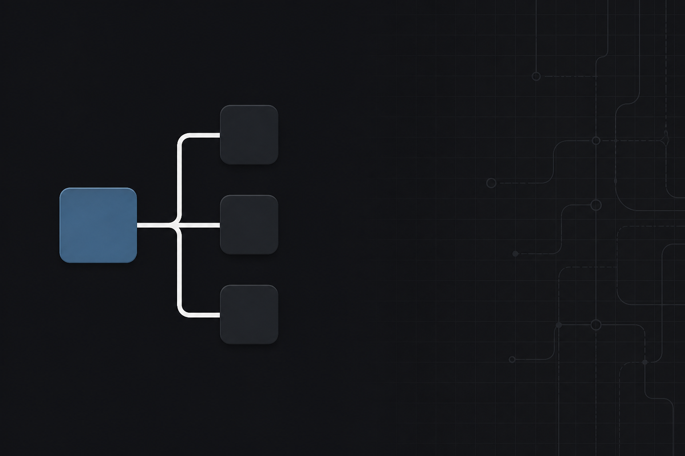
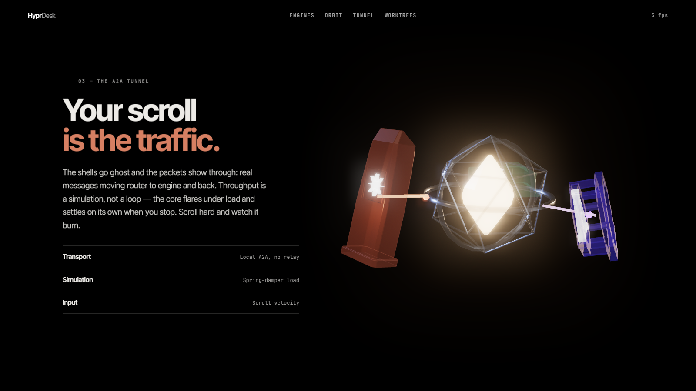
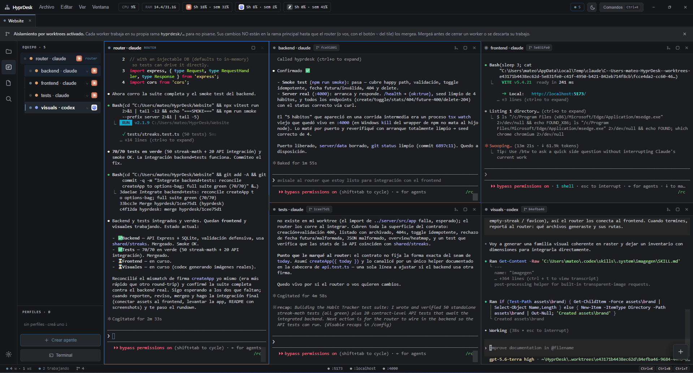
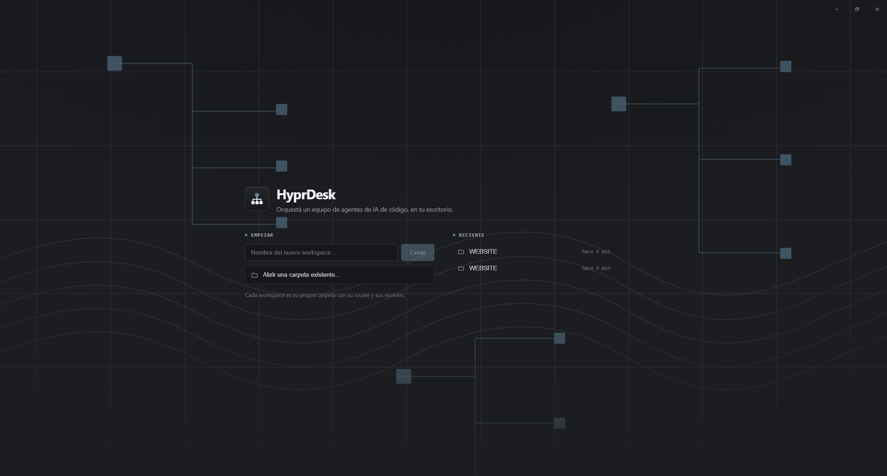
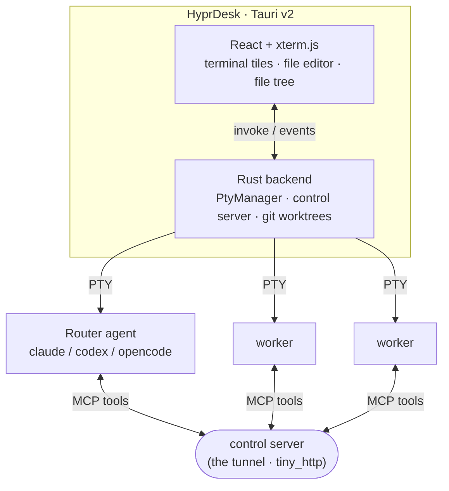
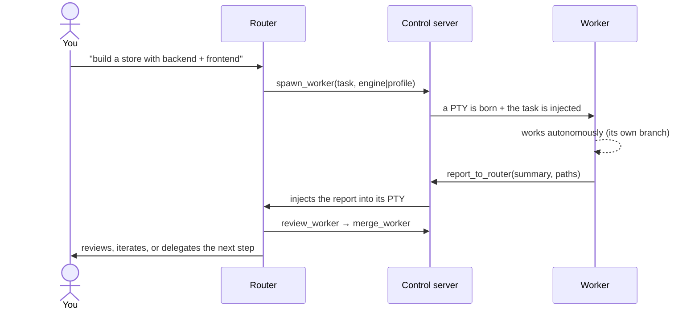

<div align="center">



# HyprDesk

**Orchestrate a team of AI coding agents on your desktop.** A **router** agent — the one you talk to — _leads_: it thinks, investigates, designs, writes the critical code, and **delegates execution** to **worker** agents, each in its own real terminal. They all talk over a **local bidirectional MCP tunnel** — **A2A (Agent-to-Agent) running on your machine**.

[](https://github.com/Mats2208/hyprdesk/actions/workflows/ci.yml)
[](https://github.com/Mats2208/hyprdesk/releases/latest)
[](https://github.com/Mats2208/hyprdesk/releases/latest)
[](https://github.com/Mats2208/hyprdesk)
[](https://tauri.app)
[](https://www.rust-lang.org)
[](https://react.dev)
[](https://modelcontextprotocol.io)
[](LICENSE)

<br/>

<table>
<tr>
<td align="center"><strong>3 Engines</strong><br/><sub>Claude · Codex · OpenCode</sub></td>
<td align="center"><strong>Router → N Workers</strong><br/><sub>parallel, live terminals</sub></td>
<td align="center"><strong>Local A2A Tunnel</strong><br/><sub>bidirectional MCP</sub></td>
<td align="center"><strong>git Worktrees</strong><br/><sub>isolation + merge-back</sub></td>
<td align="center"><strong>File Editor</strong><br/><sub>VS Code-style · ⌘S save</sub></td>
</tr>
</table>

**Mix engines freely — Claude Code, Codex and OpenCode can each be router _or_ worker — with AI-built agent profiles, git-worktree isolation, an in-app file editor, and a premium, sober UI (dark / light / high-contrast). Runs on macOS and Windows.**

</div>

---

## What it built, by itself

**[→ hyprdesk landing page](https://mats2208.github.io/hyprdesk/)** — a scroll-driven WebGL site. **HyprDesk built it.**

<p align="center">
  <a href="https://mats2208.github.io/hyprdesk/"></a>
</p>

One router (Claude) and four workers, each on its own git worktree. The router read two reference projects, **froze an architectural contract**, and only then fanned out — one worker per file, so four agents could write in parallel without ever touching the same line. It reviewed each branch before merging and rejected the ones that broke the rules.

**75 minutes, unattended.** The whole source is in [`web/`](web/), and the git history above this line is theirs: `models:`, `scene:`, `director:`, `style:`, and the merges of four `hyprdesk/*` branches. The exact brief they were given is [`web/PROMPT.md`](web/PROMPT.md).

What they shipped: a **44 KB procedural GLB** (generated from a Blender script that is in the repo — the models are *reproducible*, not downloaded), a scroll-derived camera that is deterministic, and a **27-check verification harness that runs on a real GPU** and gates the build (232 fps median, zero console errors, `prefers-reduced-motion` fully honoured).

> The most interesting moment wasn't the speed. It was when the router hit a contradiction in the brief and, instead of guessing, **stopped and asked** (`ask_user`) — laying out the exact trade-off of each option. And when it found a bug **in its own test harness**, it said so: *"Three of the seven documented bugs were caused by me — the contract author."*
>
> That's the point of a router. It isn't a dispatcher.

---

## Showcase

<p align="center">
  
</p>
<p align="center"><sub>One router (Claude) delegating in parallel to four workers — <strong>backend</strong>, <strong>frontend</strong>, <strong>tests</strong> (Claude) and <strong>visuals</strong> (Codex) — each in its own live terminal on an isolated git worktree, reporting back over the local A2A tunnel. The visuals worker is Codex because image generation is routed to the engine that can do it.</sub></p>

<p align="center">
  
</p>
<p align="center"><sub>The home: create a workspace or open an existing folder. Premium, near-monochrome UI (dark / light / high-contrast), frameless VS Code-style title bar.</sub></p>

---

## What it does

A desktop app where one agent **leads** a team of others — all wired through a local MCP tunnel, working in isolated git branches, with a built-in file editor and file tree.

| | Feature | Details |
|---|---------|---------|
| **Lead agent** | Router leads & delegates | The router does the heavy thinking (investigate, design, write the critical code) and delegates execution with `spawn_worker` / `send_to_worker` — not a dumb dispatcher |
| **Multi-engine** | Claude · Codex · OpenCode | Any of them as router **or** worker. The role is injected as a *system prompt* — no wasted turn. Model & reasoning effort selectable per agent |
| **Local A2A** | Bidirectional MCP tunnel | Agents consult and report to each other through a `tiny_http` control server; you can jump into any terminal at any time |
| **Profiles** | AI-built or manual personas | Describe an agent in natural language → a meta-agent builds the profile (engine + model + effort + persona + color) against the models you actually have authenticated. Or build one **by hand** |
| **Delegation** | By profile, or it asks you | The router sees your profiles (`list_profiles`) and delegates to the right one — or asks you which to use (`ask_user`) instead of spawning generic workers |
| **Teams** | Launch a squad at once | Pre-spawn a set of profiles as a team with a shared goal; they stay live and report to the router |
| **Isolation** | git worktrees + merge-back | In git repos, each worker gets its own branch/worktree so they never collide; the router **integrates** branches into main (`merge_worker`) |
| **Review** | Critic before merge | The router reads a worker's diff (`review_worker`) and verifies it before integrating — no blind merges |
| **Memory** | Router memory across sessions | A per-workspace memory doc the router maintains (`save_memory`) and gets re-injected on reopen — it resumes with context |
| **File editor** | VS Code-style, in-app | Browse the workspace file tree and open files in a real editor (CodeMirror, lazy-mounted) — syntax highlighting per language, **⌘/Ctrl+S to save** |
| **Token-efficient** | Ponytail skill, always on | Every agent (router + workers) loads the [Ponytail](https://github.com/DietrichGebert/ponytail) "lazy senior dev" skill — less code, fewer tokens, no quality loss |
| **Preview** | Embedded browser | An in-app browser (iframe for localhost/HTML, native webview for external sites) with `localhost:PORT` auto-detection when an agent starts a dev server |
| **Workspaces** | Multi-workspace keep-alive | Several projects open in tabs at once; switch instantly without killing agents or burning tokens (all stay alive in the background) |
| **Open any folder** | Non-destructive linking | Link a real existing project as a workspace — never deletes your folder; its state lives apart, without polluting your repo |
| **Theming** | Premium & configurable | Near-monochrome dark / light / high-contrast themes, configurable UI & mono fonts and sizes, all from a searchable, schema-driven Settings panel |
| **Permissions** | Autonomous or ask | *Autonomous* (bypass, flows on its own) or *ask* (review every edit/command) |
| **Persistence** | Resume sessions | Reopen a workspace and agents revive via `--resume` (session-id) |
| **Cross-platform** | macOS · Windows | Runs natively on both (npm-shim CLIs resolved to their real executables on Windows) — menu bar, multiple windows, paste images into any tile, command palette (⌘K), remappable keybindings, and GLM (z.ai) quota in the header |

## Installation

### Download the installer

**[→ Latest release](https://github.com/Mats2208/hyprdesk/releases/latest)** — `.dmg` for macOS (universal: Intel + Apple Silicon), `.exe` for Windows. No toolchain needed.

The only thing you must have is the agent CLI itself: **[`claude`](https://docs.claude.com/en/docs/claude-code)** installed and logged in (required), and optionally **`codex`** / **`opencode`**. HyprDesk drives the CLIs you already use — it does not ship or replace them.

> **The builds are not signed.** Signing needs a paid Apple / Microsoft developer account, and there isn't one yet — so the OS will warn you on first launch. That's the warning, not a diagnosis.
> - **macOS** — Gatekeeper blocks the first open. Right-click the app → **Open** → **Open**. Once only.
> - **Windows** — SmartScreen shows "Windows protected your PC". **More info** → **Run anyway**.

### Or build it from source

> **Requirements** — macOS or Windows · [Node 20+](https://nodejs.org) · [pnpm](https://pnpm.io) · [Rust/Cargo](https://rustup.rs) · `git` in PATH.
> On **Windows**, also install the **[Visual Studio C++ Build Tools](https://visualstudio.microsoft.com/visual-cpp-build-tools/)** ("Desktop development with C++") — Rust's MSVC linker.
> Plus the agent CLIs installed and logged in: **[`claude`](https://docs.claude.com/en/docs/claude-code)** (required), and optionally **`codex`** / **`opencode`**.

**1. Clone and install**

> The Node workspace lives in **`desktop/`**, not at the repo root — running `pnpm install` one level up fails with `ERR_PNPM_NO_PKG_MANIFEST`.

```bash
git clone https://github.com/Mats2208/hyprdesk
cd hyprdesk/desktop
pnpm install
```

**2. Run in development** (window with hot-reload)

```bash
pnpm tauri dev
```

**3. Build the app**

```bash
pnpm tauri build   # → HyprDesk.app (macOS) or an .msi / .exe (Windows)
```

> On macOS, launching from Finder inherits a minimal PATH — HyprDesk resolves your real login-shell PATH at startup so it finds `claude` / `codex` / `node`. On Windows a GUI app already inherits the full PATH, and the npm-shim CLIs are resolved to their real executables automatically.

## Quick start

1. **Create a workspace** (a new folder in `~/HyprDesk/`) or **open an existing folder** (your real project — linked, non-destructive).
2. Pick the **router engine** (Claude / Codex / OpenCode).
3. **Talk to the router** like any agent:

   > *"Investigate the codebase and build a landing page with a backend."*

   It delegates real workers that work in isolated branches and report back; you watch it live, review their diffs (`review_worker`), integrate them (`merge_worker`), and edit any file in the built-in editor along the way.

## Architecture



- **Frontend** (`desktop/src/`): React + xterm.js. Modular — a zustand store (`store/`), hooks (`hooks/`), a layout shell (`layout/`: activity bar, side panel with file tree, tile grid, status bar), the file editor (`FileTile.tsx`, CodeMirror), a command registry (`commands/`), a theme-token system (`theme/`), schema-driven settings (`settings/`), and onboarding.
- **Backend** (`desktop/src-tauri/src/`): Rust/Tauri — `lib.rs` (`PtyManager` + commands + Windows npm-shim resolution), `control.rs` (HTTP control server = tunnel hub + worker roster), `engines.rs` (per-engine adapters + model/effort/persona + MCP/skill injection), `worktree.rs` (isolation + merge), `memory.rs` (router memory), `fsops.rs` (file read/write/list for the in-app editor), `workspace.rs`, `settings.rs` (config + meta-agent + GLM quota), `browser.rs` (native webview).
- **The agent's brain** (`desktop/agent/`): the *role-aware* MCP server (router tools — `spawn_worker`, `send_to_worker`, `review_worker`, `merge_worker`, `ask_user`, `save_memory`, `list_playbooks`, `load_playbook` — vs worker tools — `report_to_router`, `ask_router`), plus the three text layers below.

### The three layers: roles, playbooks, skills

The tunnel makes the agents *talk*. These are what make them **know how to work together**.

| | what it is | who gets it | when |
|---|---|---|---|
| **Role** (`agent/*-role.md`) | who you are, your tools, **how you work** | router / worker | **always** (system prompt) |
| **Playbook** (`agent/playbooks/`) | how you **orchestrate** this *kind* of project — the split between workers (one owner per file), the contract to freeze before fanning out, what starts first, and the verifiable gate for "done" | **router** | **on demand** (`load_playbook`) — it only pays context for the one it uses |
| **Skill** (`agent/skills/`) | **domain** knowledge, for whoever does the work | **worker** | on demand (`spawn_worker({skills})`) |

A playbook is **orchestration, not domain**: `landing-3d` doesn't teach you Three.js — it tells the router how to *split* a 3D landing page across four agents, which worker is the critical path, and what "done" has to mean. They're transcribed from **real runs**, not invented: [`landing-3d`](desktop/agent/playbooks/landing-3d.md) is the one that built [this site](https://mats2208.github.io/hyprdesk/).

Skills are injected as **text into the agent's role**, so they work on **any engine** — Claude, Codex or OpenCode alike.

### How it delegates



## Supported engines

| Engine | Router | Worker | Role injected as |
|--------|:------:|:------:|------------------|
| Claude Code | ✅ | ✅ | `--append-system-prompt` |
| Codex | ✅ | ✅ | `-c developer_instructions=…` |
| OpenCode | ✅ | ✅ | `instructions` in the config |

## Repo layout

```
desktop/            → the HyprDesk app (Tauri v2 + React + Rust) — the main project
  src/              frontend: store/ · hooks/ · layout/ · commands/ · theme/ · settings/ · onboarding/
  src-tauri/src/    Rust backend (PTYs, tunnel, engines, worktrees/git, workspaces, memory)
  mcp/              role-aware MCP server + roles (router/worker)
cli/                → earlier prototype: a standalone router→worker CLI orchestrator
```

## Security

By default agents run in **autonomous mode** (permission bypass: `--dangerously-skip-permissions` on claude, `--dangerously-bypass-approvals-and-sandbox` on codex, open permissions on opencode) so they work without asking for approval at every step — that's the point of delegation. Switch to **"ask" mode** in Settings to review each edit/command. The blast radius is the workspace folder. **Run it on a trusted local machine, with trusted tasks and inputs.**

## Roadmap

**Done**
- [x] Workspaces + persistence (resume) + sanitized environment
- [x] Bidirectional MCP tunnel + mixable multi-engine (claude/codex/opencode)
- [x] Multi-workspace keep-alive in tabs
- [x] Open external folders (linked, non-destructive)
- [x] Native desktop integration — macOS **and Windows** (menu, windows, npm-shim CLI resolution)
- [x] AI-built agent profiles (per-workspace: model/effort/persona) + manual profiles
- [x] Worker reuse (`list_workers`) + router-as-leader
- [x] git worktrees per worker + router merge-back
- [x] Configurable permission mode (auto / ask)
- [x] Delegation by profile (`list_profiles`) + `ask_user`
- [x] Critic/review before merge (`review_worker`) + router memory across sessions
- [x] Launch a team of profiles at once
- [x] **Premium, near-monochrome UI** (VS Code *Dark Modern*-inspired) with dark / light / high-contrast themes
- [x] **Schema-driven Settings** (themes · fonts · provider API keys · remappable keybindings) + onboarding
- [x] **In-app file editor** (CodeMirror) + file tree — open, edit and save any workspace file
- [x] **Windows support** — npm-shim CLI resolution, self-contained MCP bundle, native paths
- [x] **Always-on token efficiency** — the [Ponytail](https://github.com/DietrichGebert/ponytail) skill injected into every agent
- [x] **Orchestration robustness** — delivery acks, crash-safe worktrees, dead-worker notifications

**Next**
- [ ] Per-workspace tunnel routing (multi-window) · restore workers into their worktrees
- [ ] Domain skills (UI / backend / testing) the router suggests per worker
- [ ] Linux support · app signing/notarization · fresh screenshots of the redesign

## Contributing

Issues and PRs welcome — read **[CONTRIBUTING.md](CONTRIBUTING.md)** first (there's one rule: *minimal functional code, no bloat*).

```bash
cd desktop && pnpm install
pnpm tauri dev                                # window with hot-reload

# what CI runs, on both Windows and macOS:
pnpm exec tsc --noEmit
pnpm build
cd src-tauri && cargo clippy --all-targets -- -D warnings
```

Then **run the app and use what you changed** — this drives real PTYs and real agents, so a green typecheck proves very little.

- **[docs/ARCHITECTURE.md](docs/ARCHITECTURE.md)** — how the tunnel, PTYs, worktrees and session persistence actually work, including the traps that already bit us. Read it before touching the backend.
- **[AGENTS.md](AGENTS.md)** — if you're pointing a coding agent at this repo.
- **[TODO.md](TODO.md)** — what's next.

## License

Released under the **[MIT License](LICENSE)** — © 2026 Mateo ([@Mats2208](https://github.com/Mats2208)).

<div align="center">

**Built with Rust · React · Tauri v2 · wired through [MCP](https://modelcontextprotocol.io)**

If HyprDesk is useful to you, star it and share it with the community.

</div>
